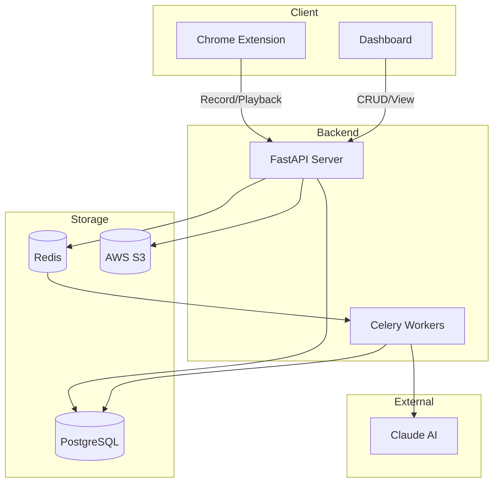

# Sprint 8: Enhancements & Polish

**Duration**: 3-4 weeks
**Focus**: Nice-to-have features, performance improvements, and final polish
**Prerequisites**: Core sprints (1-6) completed; Sprint 7 optional

---

## Sprint Goal

Add quality-of-life improvements including search/filter, keyboard shortcuts, performance optimizations, and remaining documentation. These are P3 (low priority) items that enhance the product but aren't critical for launch.

---

## Tickets (8 items)

### 1. FEAT-005: Workflow Search and Filter

**Priority**: P3 (Low)
**Component**: Dashboard
**Estimated Effort**: 2 days

#### Description

No search or filter functionality for workflows. As users accumulate workflows, finding specific ones becomes difficult.

#### Implementation

File: `dashboard/src/components/WorkflowFilters.tsx`

```typescript
import { useState } from 'react';
import { Search, Filter, X } from 'lucide-react';

interface WorkflowFiltersProps {
  onSearch: (query: string) => void;
  onFilter: (filters: WorkflowFilters) => void;
  filters: WorkflowFilters;
}

interface WorkflowFilters {
  status: 'all' | 'active' | 'draft' | 'broken';
  sortBy: 'updated' | 'created' | 'name';
  sortOrder: 'asc' | 'desc';
}

export function WorkflowFilters({ onSearch, onFilter, filters }: WorkflowFiltersProps) {
  const [searchQuery, setSearchQuery] = useState('');
  const [showFilters, setShowFilters] = useState(false);

  function handleSearch(e: React.ChangeEvent<HTMLInputElement>) {
    setSearchQuery(e.target.value);
    onSearch(e.target.value);
  }

  function handleFilterChange(key: keyof WorkflowFilters, value: string) {
    onFilter({ ...filters, [key]: value });
  }

  return (
    <div className="space-y-3">
      {/* Search Bar */}
      <div className="flex gap-2">
        <div className="relative flex-1">
          <Search className="absolute left-3 top-1/2 -translate-y-1/2 w-4 h-4 text-gray-400" />
          <input
            type="text"
            placeholder="Search workflows..."
            value={searchQuery}
            onChange={handleSearch}
            className="w-full pl-10 pr-4 py-2 border rounded-lg focus:ring-2 focus:ring-blue-500"
          />
          {searchQuery && (
            <button
              onClick={() => { setSearchQuery(''); onSearch(''); }}
              className="absolute right-3 top-1/2 -translate-y-1/2"
            >
              <X className="w-4 h-4 text-gray-400" />
            </button>
          )}
        </div>

        <button
          onClick={() => setShowFilters(!showFilters)}
          className={`px-3 py-2 border rounded-lg flex items-center gap-2 ${
            showFilters ? 'bg-gray-100' : ''
          }`}
        >
          <Filter className="w-4 h-4" />
          Filters
        </button>
      </div>

      {/* Filter Options */}
      {showFilters && (
        <div className="flex gap-4 p-3 bg-gray-50 rounded-lg">
          <div>
            <label className="block text-xs font-medium text-gray-500 mb-1">Status</label>
            <select
              value={filters.status}
              onChange={e => handleFilterChange('status', e.target.value)}
              className="border rounded px-2 py-1 text-sm"
            >
              <option value="all">All</option>
              <option value="active">Active</option>
              <option value="draft">Draft</option>
              <option value="broken">Broken</option>
            </select>
          </div>

          <div>
            <label className="block text-xs font-medium text-gray-500 mb-1">Sort By</label>
            <select
              value={filters.sortBy}
              onChange={e => handleFilterChange('sortBy', e.target.value)}
              className="border rounded px-2 py-1 text-sm"
            >
              <option value="updated">Last Updated</option>
              <option value="created">Created Date</option>
              <option value="name">Name</option>
            </select>
          </div>

          <div>
            <label className="block text-xs font-medium text-gray-500 mb-1">Order</label>
            <select
              value={filters.sortOrder}
              onChange={e => handleFilterChange('sortOrder', e.target.value)}
              className="border rounded px-2 py-1 text-sm"
            >
              <option value="desc">Newest First</option>
              <option value="asc">Oldest First</option>
            </select>
          </div>
        </div>
      )}
    </div>
  );
}
```

**Backend Support** (if needed for server-side search):

```python
@router.get("/workflows")
async def list_workflows(
    search: Optional[str] = Query(None),
    status: Optional[str] = Query(None),
    sort_by: str = Query("updated_at"),
    sort_order: str = Query("desc"),
    # ...
):
    query = db.query(Workflow).filter(...)

    if search:
        query = query.filter(
            Workflow.name.ilike(f"%{search}%")
        )

    if status and status != "all":
        query = query.filter(Workflow.status == status)

    # Apply sorting
    order_column = getattr(Workflow, sort_by, Workflow.updated_at)
    if sort_order == "desc":
        query = query.order_by(order_column.desc())
    else:
        query = query.order_by(order_column.asc())
```

#### Acceptance Criteria
- [ ] Search by workflow name (client-side for now)
- [ ] Filter by status (active/draft/broken)
- [ ] Sort options (updated, created, name)
- [ ] Clear search/reset filters
- [ ] Results update in real-time

---

### 2. FEAT-006: Keyboard Shortcuts in Walkthrough

**Priority**: P3 (Low)
**Component**: Extension
**Estimated Effort**: 1-2 days

#### Description

No keyboard navigation in walkthrough mode. Power users want shortcuts.

#### Implementation

File: `extension/src/content/walkthrough.ts`

Add keyboard event handling:

```typescript
class WalkthroughController {
  private keyboardShortcuts: Map<string, () => void>;

  constructor() {
    this.keyboardShortcuts = new Map([
      ['n', () => this.nextStep()],
      ['b', () => this.previousStep()],
      ['Escape', () => this.exitWalkthrough()],
      ['s', () => this.skipStep()],
      ['?', () => this.showHelp()],
    ]);

    this.setupKeyboardListeners();
  }

  private setupKeyboardListeners() {
    document.addEventListener('keydown', this.handleKeydown.bind(this));
  }

  private handleKeydown(event: KeyboardEvent) {
    // Don't capture if user is typing in an input
    if (this.isInputFocused()) return;

    // Don't capture if modifier keys are pressed
    if (event.ctrlKey || event.metaKey || event.altKey) return;

    const handler = this.keyboardShortcuts.get(event.key);
    if (handler) {
      event.preventDefault();
      handler();
    }
  }

  private isInputFocused(): boolean {
    const activeElement = document.activeElement;
    if (!activeElement) return false;

    const inputElements = ['INPUT', 'TEXTAREA', 'SELECT'];
    return inputElements.includes(activeElement.tagName) ||
           activeElement.getAttribute('contenteditable') === 'true';
  }

  private showHelp() {
    // Show keyboard shortcuts overlay
    this.showHelpOverlay();
  }

  private showHelpOverlay() {
    const overlay = document.createElement('div');
    overlay.className = 'overlay-help-modal';
    overlay.innerHTML = `
      <div class="overlay-help-content">
        <h3>Keyboard Shortcuts</h3>
        <ul>
          <li><kbd>N</kbd> Next step</li>
          <li><kbd>B</kbd> Previous step</li>
          <li><kbd>S</kbd> Skip step</li>
          <li><kbd>Esc</kbd> Exit walkthrough</li>
          <li><kbd>?</kbd> Show this help</li>
        </ul>
        <button onclick="this.parentElement.parentElement.remove()">Close</button>
      </div>
    `;
    document.body.appendChild(overlay);
  }

  destroy() {
    document.removeEventListener('keydown', this.handleKeydown.bind(this));
  }
}
```

**Add hint to walkthrough tooltip**:

```typescript
// In tooltip creation
tooltipElement.innerHTML = `
  <div class="step-content">
    <p>${stepLabel}</p>
    <p class="instruction">${stepDescription}</p>
  </div>
  <div class="step-nav">
    <button class="nav-btn" onclick="walkthroughBack()">← Back</button>
    <span class="step-counter">${currentStep}/${totalSteps}</span>
    <button class="nav-btn" onclick="walkthroughNext()">Next →</button>
  </div>
  <div class="keyboard-hint">
    Press <kbd>?</kbd> for keyboard shortcuts
  </div>
`;
```

#### Acceptance Criteria
- [ ] N for next step
- [ ] B for back/previous
- [ ] Esc to exit walkthrough
- [ ] S to skip step
- [ ] ? to show help
- [ ] Shortcuts disabled when typing in inputs
- [ ] Keyboard hint shown in UI

---

### 3. FEAT-007: Input Format Validation in Walkthrough

**Priority**: P3 (Low)
**Component**: Extension
**Estimated Effort**: 2 days

#### Description

Walkthrough doesn't validate input formats (dates, emails, etc.). Users may enter incorrect formats and only discover errors later.

#### Implementation

```typescript
interface InputValidation {
  type: 'email' | 'date' | 'phone' | 'number' | 'url' | 'custom';
  pattern?: RegExp;
  message?: string;
}

function detectInputType(inputElement: HTMLInputElement): InputValidation | null {
  // Check HTML5 input type
  switch (inputElement.type) {
    case 'email':
      return { type: 'email', message: 'Please enter a valid email address' };
    case 'date':
      return { type: 'date', message: 'Please enter a valid date' };
    case 'tel':
      return { type: 'phone', message: 'Please enter a valid phone number' };
    case 'number':
      return { type: 'number', message: 'Please enter a number' };
    case 'url':
      return { type: 'url', message: 'Please enter a valid URL' };
  }

  // Check input name/placeholder for hints
  const name = (inputElement.name + inputElement.placeholder).toLowerCase();
  if (name.includes('email')) {
    return { type: 'email', message: 'This looks like an email field' };
  }
  if (name.includes('phone') || name.includes('tel')) {
    return { type: 'phone' };
  }
  if (name.includes('date') || name.includes('dob') || name.includes('birthday')) {
    return { type: 'date' };
  }

  return null;
}

function validateInput(value: string, validation: InputValidation): boolean {
  const patterns: Record<string, RegExp> = {
    email: /^[^\s@]+@[^\s@]+\.[^\s@]+$/,
    phone: /^[\d\s\-\+\(\)]{7,20}$/,
    date: /^\d{4}-\d{2}-\d{2}$|^\d{2}\/\d{2}\/\d{4}$/,
    number: /^-?\d+\.?\d*$/,
    url: /^https?:\/\/.+/,
  };

  const pattern = validation.pattern || patterns[validation.type];
  return pattern ? pattern.test(value) : true;
}

// In walkthrough input handling
function handleInputComplete(inputElement: HTMLInputElement) {
  const validation = detectInputType(inputElement);
  if (validation) {
    const isValid = validateInput(inputElement.value, validation);
    if (!isValid) {
      showValidationWarning(validation.message || 'Please check your input format');
      // Don't block progress, just warn
    }
  }
  // Continue with step completion
}
```

#### Acceptance Criteria
- [ ] Detect expected format from input type/name
- [ ] Show warning for incorrect format
- [ ] Don't block progress (just warn)
- [ ] Support email, date, phone, number, URL
- [ ] Allow user to correct without losing progress

---

### 4. FEAT-008: Retry Limit with Skip Option

**Priority**: P3 (Low)
**Component**: Extension
**Estimated Effort**: 1 day

#### Description

No retry limit per step in walkthrough. If element can't be found, users get stuck.

#### Implementation

```typescript
interface StepAttempts {
  stepId: string;
  attempts: number;
  lastAttempt: Date;
}

class WalkthroughController {
  private stepAttempts: Map<string, StepAttempts> = new Map();
  private readonly MAX_RETRIES = 3;

  private recordAttempt(stepId: string, success: boolean) {
    const current = this.stepAttempts.get(stepId) || { stepId, attempts: 0, lastAttempt: new Date() };
    current.attempts++;
    current.lastAttempt = new Date();
    this.stepAttempts.set(stepId, current);

    if (!success && current.attempts >= this.MAX_RETRIES) {
      this.showRetryLimitReached(stepId);
    }
  }

  private showRetryLimitReached(stepId: string) {
    const overlay = this.createOverlay(`
      <h3>Having trouble with this step?</h3>
      <p>We couldn't find the element after ${this.MAX_RETRIES} attempts.</p>
      <div class="actions">
        <button class="btn-primary" onclick="walkthroughSkip()">Skip This Step</button>
        <button class="btn-secondary" onclick="walkthroughRetry()">Try Again</button>
        <button class="btn-link" onclick="walkthroughReport()">Report Issue</button>
      </div>
    `);

    document.body.appendChild(overlay);
  }

  skipStep() {
    const currentStep = this.getCurrentStep();

    // Log skipped step for analytics
    this.logSkippedStep(currentStep.id, this.stepAttempts.get(currentStep.id));

    // Move to next step
    this.goToStep(this.currentStepIndex + 1);
  }

  private logSkippedStep(stepId: string, attempts: StepAttempts | undefined) {
    // Send to backend for workflow health tracking
    fetch('/api/walkthrough/skip', {
      method: 'POST',
      body: JSON.stringify({
        step_id: stepId,
        attempts: attempts?.attempts || 0,
        reason: 'element_not_found'
      })
    });
  }
}
```

#### Acceptance Criteria
- [ ] Track retries per step
- [ ] After 3 retries, offer "Skip" and "Report issue"
- [ ] Log skipped steps
- [ ] Can continue walkthrough after skip
- [ ] Reset attempts on successful completion

---

### 5. DOC-007: Architecture Diagrams

**Priority**: P3 (Low)
**Component**: Docs
**Estimated Effort**: 1 day

#### Description

No visual system architecture diagrams.

#### Diagrams to Create

1. **High-Level System Diagram**
   - Extension, Dashboard, Backend, Database, Redis, S3
   - Data flow arrows

2. **Recording Flow Sequence Diagram**
   - User → Extension → Content Script → Backend → AI Service → Database

3. **Walkthrough Flow Sequence Diagram**
   - User → Extension → Healing → Element Finding → Action Validation

4. **Authentication Flow**
   - Login, JWT, Token refresh

#### Tools

- Use Mermaid.js (renders in GitHub markdown)
- Or Excalidraw for hand-drawn style
- Or draw.io for formal diagrams

#### Example Mermaid Diagram

```markdown
# System Architecture


```

#### Acceptance Criteria
- [ ] High-level system diagram
- [ ] Recording flow sequence diagram
- [ ] Walkthrough flow sequence diagram
- [ ] Diagrams render in GitHub
- [ ] Added to docs/architecture.md

---

### 6. PERF-001: Performance Tests for Large Workflows

**Priority**: P3 (Low)
**Component**: All
**Estimated Effort**: 1-2 days

#### Description

No performance tests exist for workflows with many steps.

#### Implementation

File: `backend/tests/performance/test_large_workflows.py`

```python
import pytest
import time
from app.models.workflow import Workflow
from app.models.step import Step

class TestLargeWorkflowPerformance:
    """Performance tests for workflows with many steps."""

    @pytest.fixture
    def large_workflow(self, db, test_company):
        """Create a workflow with 100 steps."""
        workflow = Workflow(
            name="Large Test Workflow",
            company_id=test_company.id,
            status="active"
        )
        db.add(workflow)
        db.commit()

        # Add 100 steps
        for i in range(100):
            step = Step(
                workflow_id=workflow.id,
                order_index=i,
                action_type="click",
                target_selector=f"#element-{i}",
                ai_label=f"Step {i}: Click element {i}"
            )
            db.add(step)
        db.commit()

        return workflow

    def test_get_workflow_performance(self, client, auth_headers, large_workflow):
        """GET /api/workflows/{id} should complete in < 500ms for 100 steps."""
        start = time.time()
        response = client.get(
            f"/api/workflows/{large_workflow.id}",
            headers=auth_headers
        )
        elapsed = (time.time() - start) * 1000

        assert response.status_code == 200
        assert elapsed < 500, f"Response took {elapsed}ms (should be < 500ms)"
        assert len(response.json()["steps"]) == 100

    def test_list_workflows_performance(self, client, auth_headers, db, test_company):
        """List workflows should complete in < 1s for 50 workflows."""
        # Create 50 workflows
        for i in range(50):
            workflow = Workflow(name=f"Workflow {i}", company_id=test_company.id)
            db.add(workflow)
        db.commit()

        start = time.time()
        response = client.get("/api/workflows", headers=auth_headers)
        elapsed = (time.time() - start) * 1000

        assert response.status_code == 200
        assert elapsed < 1000, f"Response took {elapsed}ms (should be < 1000ms)"

    def test_healing_candidates_performance(self, benchmark_healing):
        """Healing should find candidates in < 100ms for page with 1000 elements."""
        # This would need to run in extension context
        pass
```

File: `extension/src/content/healing/__tests__/performance.test.ts`

```typescript
import { findCandidates } from '../candidateFinder';
import { scoreCandidate } from '../scorer';

describe('Healing Performance', () => {
  beforeEach(() => {
    // Create DOM with 500 elements
    document.body.innerHTML = '';
    for (let i = 0; i < 500; i++) {
      const div = document.createElement('div');
      div.id = `element-${i}`;
      div.className = `class-${i % 10}`;
      div.textContent = `Element ${i}`;
      document.body.appendChild(div);
    }
  });

  it('finds candidates in < 50ms', () => {
    const start = performance.now();

    const candidates = findCandidates({
      text: 'Element 250',
      tagName: 'div',
    });

    const elapsed = performance.now() - start;

    expect(candidates.length).toBeGreaterThan(0);
    expect(elapsed).toBeLessThan(50);
  });

  it('scores candidate in < 5ms', () => {
    const element = document.getElementById('element-250')!;
    const original = {
      text: 'Element 250',
      tagName: 'DIV',
      id: 'element-250',
    };

    const start = performance.now();

    for (let i = 0; i < 100; i++) {
      scoreCandidate(element, original);
    }

    const elapsed = performance.now() - start;
    const perScore = elapsed / 100;

    expect(perScore).toBeLessThan(5);
  });
});
```

#### Acceptance Criteria
- [ ] Performance tests for 100+ step workflows
- [ ] Memory usage profiling
- [ ] Benchmark healing with many candidates
- [ ] Document baseline performance numbers
- [ ] CI runs performance tests (optional)

---

### 7. REFACTOR-001: Extract Magic Numbers in Healing

**Priority**: P3 (Low)
**Component**: Extension
**Estimated Effort**: 1 day

#### Description

Healing factors have magic numbers without explanation.

#### Current State

```typescript
// extension/src/content/healing/factors/positionSimilarity.ts
if (distance < 50) {
  positionScore = 0.9;  // Why 50? Why 0.9?
}
```

#### Implementation

File: `extension/src/content/healing/config.ts`

```typescript
/**
 * Healing configuration constants.
 * These values were tuned through testing and can be adjusted.
 */
export const HEALING_CONFIG = {
  // Position similarity thresholds
  position: {
    /** Maximum pixel distance considered "same position" */
    EXACT_MATCH_THRESHOLD: 10,
    /** Maximum pixel distance considered "close" */
    CLOSE_MATCH_THRESHOLD: 50,
    /** Maximum pixel distance before soft veto */
    SOFT_VETO_THRESHOLD: 200,
    /** Score for exact position match */
    EXACT_MATCH_SCORE: 1.0,
    /** Score for close position match */
    CLOSE_MATCH_SCORE: 0.9,
    /** Score for moderate position difference */
    MODERATE_MATCH_SCORE: 0.7,
  },

  // Text similarity thresholds
  text: {
    /** Levenshtein distance ratio for exact match */
    EXACT_MATCH_RATIO: 0.95,
    /** Minimum ratio to be considered a match */
    MIN_MATCH_RATIO: 0.6,
  },

  // Attribute matching
  attributes: {
    /** Score boost for matching stable ID */
    STABLE_ID_BOOST: 0.3,
    /** IDs containing these are considered unstable */
    UNSTABLE_ID_PATTERNS: ['react', 'ng-', 'ember', 'vue-', '__', 'uuid', 'guid'],
  },

  // Overall scoring
  scoring: {
    /** Weights for each factor (must sum to 1.0) */
    WEIGHTS: {
      text: 0.35,
      position: 0.20,
      attributes: 0.25,
      role: 0.10,
      context: 0.10,
    },
    /** Minimum score to accept a candidate */
    MIN_ACCEPTANCE_SCORE: 0.6,
    /** Score above which we auto-accept */
    AUTO_ACCEPT_THRESHOLD: 0.85,
  },
} as const;
```

**Update factor files to use config**:

```typescript
// positionSimilarity.ts
import { HEALING_CONFIG } from '../config';

const { EXACT_MATCH_THRESHOLD, CLOSE_MATCH_THRESHOLD, EXACT_MATCH_SCORE, CLOSE_MATCH_SCORE } =
  HEALING_CONFIG.position;

export function calculatePositionSimilarity(current: Position, original: Position): number {
  const distance = euclideanDistance(current, original);

  if (distance < EXACT_MATCH_THRESHOLD) {
    return EXACT_MATCH_SCORE;
  }

  if (distance < CLOSE_MATCH_THRESHOLD) {
    return CLOSE_MATCH_SCORE;
  }

  // ...
}
```

#### Acceptance Criteria
- [ ] All magic numbers extracted to config file
- [ ] Config file has documentation comments
- [ ] No hard-coded numbers in factor files
- [ ] Tests pass with extracted constants

---

### 8. DOC-005 & DOC-006: JSDoc and Contributing Guide

**Priority**: P3 (Low)
**Component**: Dashboard + Root
**Estimated Effort**: 1-2 days

#### DOC-005: Add JSDoc to Dashboard Components

```typescript
/**
 * StepCard displays a single workflow step with its details and actions.
 *
 * @component
 * @example
 * <StepCard
 *   step={step}
 *   onEdit={(id) => handleEdit(id)}
 *   onDelete={(id) => handleDelete(id)}
 *   totalSteps={10}
 * />
 */
interface StepCardProps {
  /** The step data to display */
  step: Step;
  /** Callback when edit button clicked */
  onEdit: (stepId: string) => void;
  /** Callback when delete button clicked */
  onDelete: (stepId: string) => Promise<void>;
  /** Total steps in workflow (for delete validation) */
  totalSteps: number;
}

export function StepCard({ step, onEdit, onDelete, totalSteps }: StepCardProps) {
  // ...
}
```

#### DOC-006: Create CONTRIBUTING.md

File: `CONTRIBUTING.md`

```markdown
# Contributing to Overlay

Thank you for contributing! This guide helps you get started.

## Development Setup

See [README.md](./README.md) for setup instructions.

## Code Style

### TypeScript/JavaScript
- Use Prettier for formatting (config in `.prettierrc`)
- Use ESLint for linting (config in `.eslintrc`)
- Prefer functional components with hooks
- Use TypeScript strict mode

### Python
- Use Black for formatting
- Use flake8 for linting
- Use type hints for all public functions
- Follow PEP 8 style guide

## Commit Messages

Format: `type(scope): description`

Types:
- `feat`: New feature
- `fix`: Bug fix
- `docs`: Documentation
- `refactor`: Code refactoring
- `test`: Adding tests
- `chore`: Maintenance tasks

Examples:
- `feat(extension): add keyboard shortcuts to walkthrough`
- `fix(backend): handle null step positions`
- `docs(readme): update setup instructions`

## Pull Request Process

1. Create a feature branch: `git checkout -b feat/your-feature`
2. Make your changes with tests
3. Run the test suite: `npm test` / `pytest`
4. Create a PR with description of changes
5. Wait for review and address feedback

## Testing Requirements

- All new features must include tests
- Bug fixes should include regression tests
- Maintain or improve code coverage

## Code Review Checklist

- [ ] Code follows style guidelines
- [ ] Tests pass
- [ ] Documentation updated if needed
- [ ] No console.log or debug statements
- [ ] Error handling is appropriate

## Questions?

Open an issue or reach out to the maintainers.
```

#### Acceptance Criteria
- [ ] All component files have JSDoc headers
- [ ] Props documented with descriptions
- [ ] CONTRIBUTING.md created
- [ ] PR template created (.github/PULL_REQUEST_TEMPLATE.md)

---

## Sprint Execution Checklist

### Before Starting
- [ ] Core sprints (1-6) completed
- [ ] All tests passing
- [ ] Review priorities and adjust if needed

### During Sprint
- [ ] Pick highest-impact items first
- [ ] Skip items if running low on time
- [ ] Update sprint.md with progress

### Before Completing
- [ ] Completed items working
- [ ] Tests pass
- [ ] Documentation updated

---

## Completion Criteria

Sprint is complete when:
1. At least 5 of 8 tickets completed
2. Search/filter functionality works
3. Keyboard shortcuts in walkthrough
4. Architecture diagrams created
5. All tests pass
6. Documentation improvements merged

---

## Notes

This sprint contains nice-to-have items. Prioritize based on:
1. User feedback
2. Time remaining
3. Dependencies with other work

Items can be deferred to future sprints if needed.
